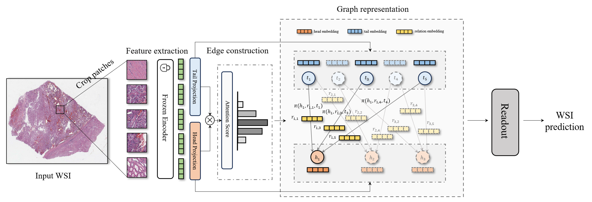

# [CVPR 2024] Dynamic Graph Representation with Knowledge-aware Attention for Histopathology Whole Slide Image Analysis
## 1. Introduction
### WiKG: *Whole Slide Image is a **K**nowledge Graph*

We demonstrate a novel whole slide image (WSI) analysis method based on graph representation called *WiKG*, which represents a WSI as a knowledge graph, cropped patches as graph nodes, and uses the head-to-tail embedding of patches to generate dynamic graph representations. 

## 2. For Model Code
This repository is based on the Pytorch version of the WiKG code. 

The easy-to-follow model code and train demo code have been released, and we will add more details soon.

## 3. For Preprint Paper
Our articles will be released in *Arxiv* first.

-----------------------
*Jiawen Li, H&G Pathology AI Research Team*

